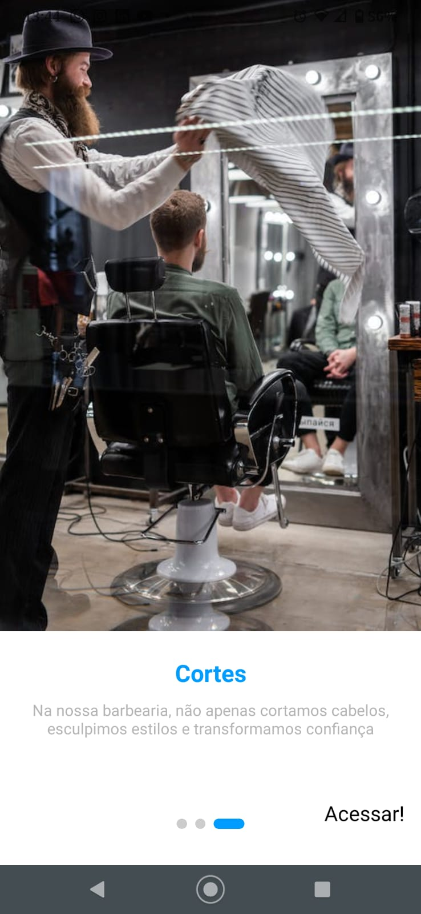
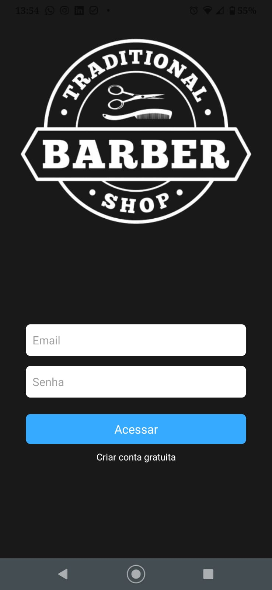

# Aplicativo React Native de Barbearia

Este é um exemplo de um aplicativo React Native para uma barbearia. O aplicativo inclui telas de introdução, login.

## Estrutura do Projeto

O projeto está estruturado da seguinte forma:

- `App.js`: O ponto de entrada do aplicativo, que gerencia a navegação entre a tela de introdução e a tela de login.

- `IntroSlider.js`: Uma tela de introdução que exibe uma série de slides com informações sobre a barbearia.

- `LoginScreen.js`: Uma tela de login que permite aos usuários acessarem o aplicativo.

## Funcionalidades Principais

### Tela de Introdução

A tela de introdução exibe informações sobre a barbearia em forma de slides. Cada slide contém um título, texto descritivo e uma imagem.

### Tela de Login

A tela de login permite que os usuários acessem o aplicativo inserindo seu email e senha. Quando o teclado é exibido, a interface do usuário é ajustada automaticamente.

## O Que Aprendi

Ao desenvolver este projeto, aprendi várias habilidades e conceitos importantes, incluindo:

- Criação de telas de introdução atraentes com React Native.

- Gerenciamento de estado usando hooks, como `useState` e `useEffect`.

- Animações de elementos da interface do usuário usando a biblioteca `react-native`.

- Integração de imagens e assets em um aplicativo React Native.

- Configuração de uma tela de login responsiva que se ajusta ao teclado.

## Como Executar o Projeto

Para executar o projeto, siga estas etapas:

1. Certifique-se de ter o ambiente de desenvolvimento React Native configurado em seu sistema.

2. Clone este repositório em seu computador.

3. Navegue até o diretório raiz do projeto no terminal.

4. Execute o comando `npm install` para instalar as dependências.

5. Execute o comando `npx react-native run-android` para iniciar o aplicativo no Android (ou `npx react-native run-ios` para iOS).

6. O aplicativo será aberto em seu emulador ou dispositivo.

# 👥 Confira:

### Aplicativo React Native de Barbearia

<ul style="list-style-type:none; display:flex; justify-content:space-between;">
  <li>

    
  </li>
  <li>
    
  </li>
  <li>
    
  </li>
  <li>
    
  </li>
</ul>

## Licença

Este projeto está licenciado sob a Licença MIT. Consulte o arquivo `LICENSE` para obter mais detalhes.
